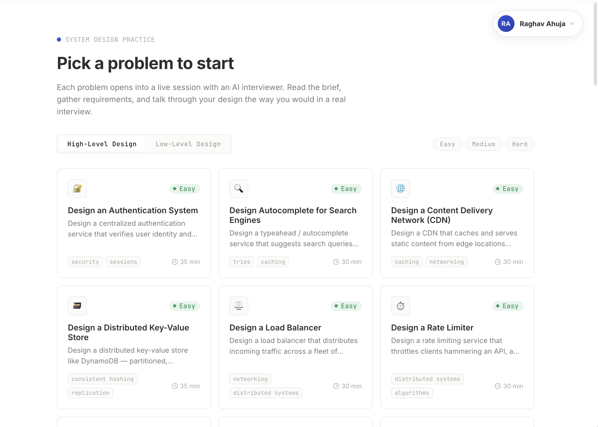
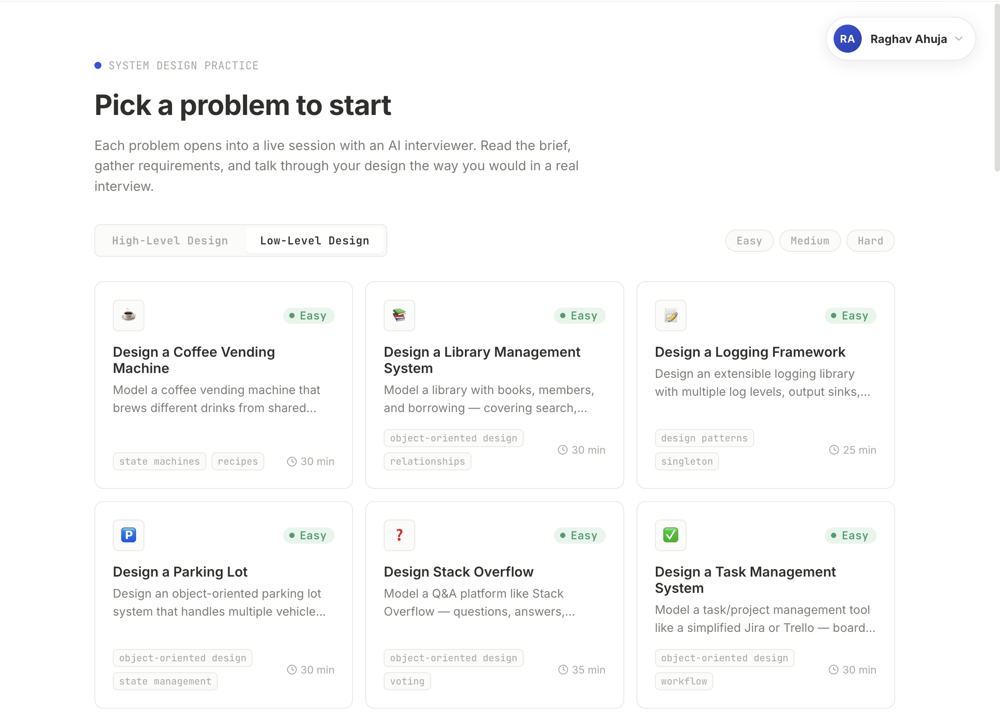
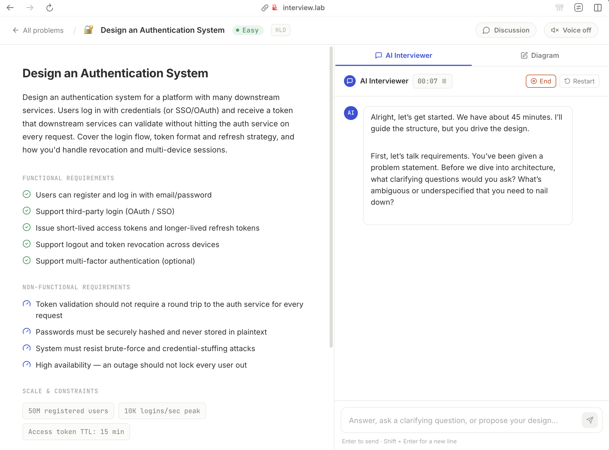
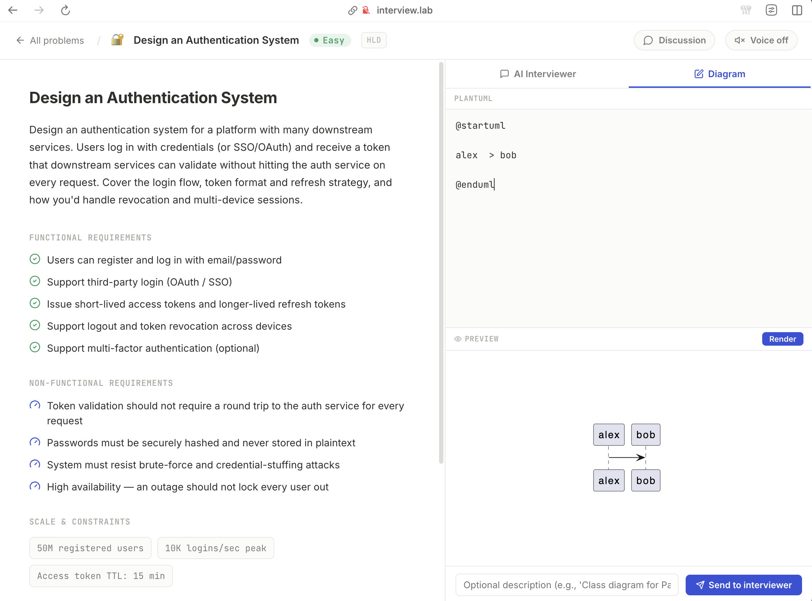
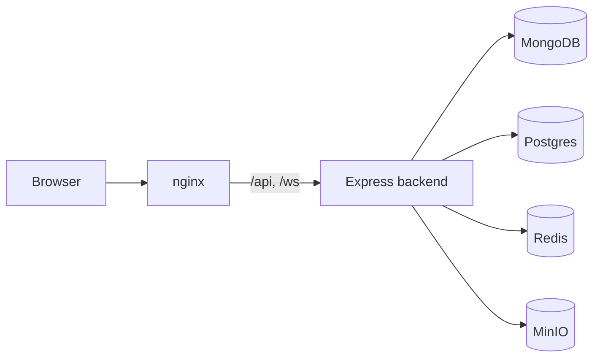
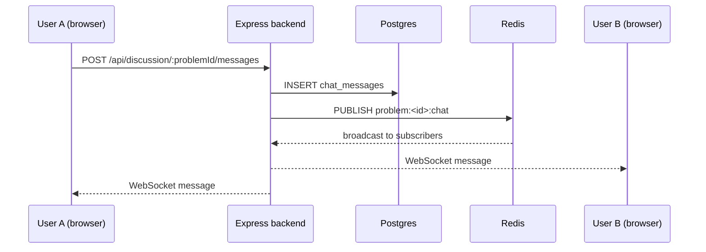

# System prep.

System design interview practice, on your own terms.

prep. is a self-hosted practice tool for system design interviews. Pick a high
level or low level design problem, get interviewed by an AI interviewer that
follows the shape of a real interview, and finish with a score and a written
evaluation of where you stand.

## Screenshots

<p align="center">
  
  <br />
  <em>The high level design problem browser</em>
</p>

<p align="center">
  
  <br />
  <em>The low level design problem browser</em>
</p>

<p align="center">
  
  <br />
  <em>An active interview with the AI interviewer</em>
</p>

<p align="center">
  
  <br />
  <em>Diagram sketching during an interview</em>
</p>

## Features

**A realistic interview flow.** Every session moves through requirements,
estimation, data model, high level architecture, deep dives, and a wrap up,
mirroring a real system design round.

**Scored feedback.** When you finish, you get a score out of 10 and a full
written evaluation. Interviews that end early are capped at a lower score, so
there is no incentive to stop before you are ready.

**Diagrams as you go.** Sketch PlantUML diagrams during the interview. They are
rendered and stored, and you can attach them to your answers or review them
later.

**Voice replies.** The interviewer can read its responses aloud, so you can
practice the way you would in a real meeting instead of reading from a screen.

**A live discussion for every problem.** Everyone viewing the same problem can
chat in real time. Messages are stored in Postgres and fanned out through Redis
pub/sub, so history survives restarts and anyone joining sees the conversation
so far, plus who is online.

**Your history, kept.** Every session is saved to your profile with its score
and evaluation, so you can look back and see how you have improved.

**Invite only.** Registration is gated by invite codes managed in your own
Postgres. No third party account required.

## How it works

A session starts from the problem browser. Each problem is either high level or
low level design, with a brief, functional requirements, non functional
requirements, scale and constraints. Once you open it, the AI interviewer runs
the session through the standard interview arc. You answer in your own words,
draw diagrams when it helps, and the interviewer pushes back and goes deeper.

When you end the interview, the evaluator scores your answers out of 10 and
writes up what went well and what to focus on next. That evaluation is stored
with the conversation so you can track your progress over time.

## Architecture

The frontend is a React single page app served by nginx. All API and AI calls
go through the Express backend, which is the single source of truth. The
backend keeps interview conversations in MongoDB, authentication and the
discussion chat in Postgres, and uses Redis for real time chat fan out and
online presence. Generated diagrams are stored in MinIO object storage.



### Message flow for a live discussion



## Tech stack

- **Frontend:** React 18, Vite, react-router-dom, lucide-react, marked
- **Backend:** Express 4, Mongoose, OpenAI SDK
- **AI:** DeepSeek API
- **Databases:** MongoDB (conversations), Postgres (auth + discussion), Redis (real time chat and presence)
- **Storage:** MinIO (diagrams)
- **Hosting:** k3s with Traefik

## Project structure

```
interview_prep/
├── src/          React frontend
│   ├── api/      API clients
│   ├── components/
│   ├── pages/
│   └── data/     Problem definitions (seed source)
├── backend/      Express API
│   ├── routes/
│   ├── services/
│   ├── models/
│   └── seed/
├── k8s/          Deployment manifests
├── nginx/        Frontend proxy config
└── Dockerfile
```

## Getting started

Prerequisites, environment setup, seeding the database, and running both
servers locally are documented in [LocalDevelopment.md](LocalDevelopment.md).

The project is designed to run in a k3s cluster behind Traefik. Local
development runs the backend on port 4000 and the frontend on port 5173, with
MongoDB, Postgres, and Redis reachable via port forwards. See
[LocalDevelopment.md](LocalDevelopment.md) for the full setup, deployment, and
re-deploying instructions.

## License

Private project. All rights reserved. No license file is included, and the
packages are marked private, so the code is not licensed for reuse or
redistribution.
